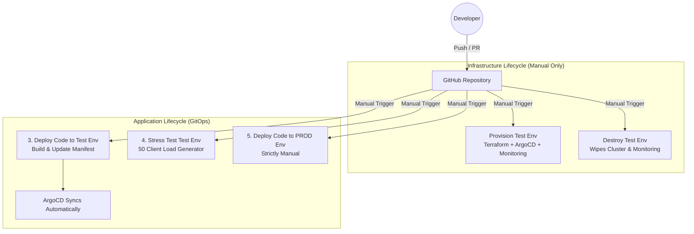

  
  <h1>Modern Enterprise IRC Network</h1>
  
A highly-scalable, 100% free, Kubernetes-native IRC daemon and web client built for the modern cloud.

---

## 🏗 Architecture
This project is built to the absolute gold standard of GitOps and Cloud-Native engineering, adhering strictly to a $0 resource footprint (Rule 8).

- **Core Daemon:** Go (Golang) - Highly concurrent, lightweight memory footprint.
- **Services:** Python - Externalized NickServ/ChanServ logic.
- **Client:** React + TypeScript - A web-based, mIRC-styled frontend.
- **State Backend:** Valkey - Distributed in-memory Pub/Sub for cross-node messaging.
- **Infrastructure:** Oracle Cloud (Ampere A1 ARM64) via Terraform.
- **Orchestration:** `k3s` (Lightweight Kubernetes).
- **CI/CD:** GitHub Actions -> ArgoCD (GitOps).
- **Observability:** Prometheus, Grafana, and Loki (Chat Moderation Logging).

### CI/CD Deployment Flow

## 🚀 Environments
1. **Test Environment (1 Node):** Internal testing and load verification.
2. **Production Environment (2 Nodes):** High-Availability active-active cluster with 100% uptime via rolling restarts.

## 📖 Documentation
- [Architecture & DevOps Plan](docs/ARCHITECTURE.md) - The detailed GitOps and infrastructure strategy.
- [AI Rules](AI_RULES.md) - The strict coding and operational constraints for this repository.
- [Release History](RELEASES.md) - Changelog for all deployments and feature rollouts.
