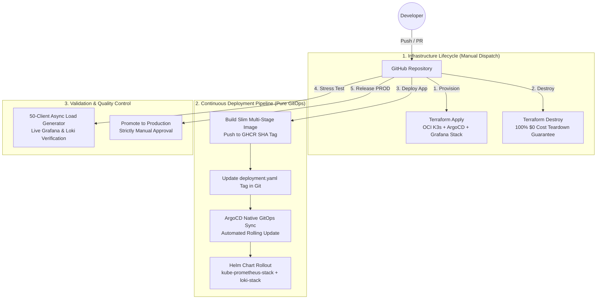

  
  <h1>Modern Enterprise IRC Network</h1>
  
A highly-scalable, 100% free, Kubernetes-native IRC daemon and web client built for the modern cloud.

---

## 🏗 Core Stack Architecture
This project is built to the absolute gold standard of GitOps and Cloud-Native engineering, adhering strictly to a $0 resource footprint ([Rule 8](AI_RULES.md#L27)).

- **Core Daemon:** Go (Golang) - Highly concurrent, goroutine-based, ~2.4MB idle memory footprint.
- **Services:** Python - Externalized NickServ/ChanServ logic.
- **Client:** React + TypeScript - A web-based, mIRC-styled frontend.
- **State Backend:** Valkey - Distributed in-memory Pub/Sub for cross-node messaging (~4.8MB RAM).
- **Infrastructure:** Oracle Cloud (Ampere A1 ARM64) via Terraform.
- **Orchestration:** `k3s` (Lightweight Kubernetes).
- **GitOps Engine:** ArgoCD - Automatic declarative manifest synchronization.
- **Observability:** Prometheus, Grafana, and Loki (High-resolution 5s metric scraping & moderation logging).

---

## ⚡ Enterprise GitOps & Optimized Deployment Pipeline

Our deployment process has been engineered for maximum performance, minimal resource consumption, and zero-downtime GitOps synchronization:

### Key Engineering & Optimization Highlights

1. **Ultra-Slim Multi-Stage Container Packaging**:
   - We compile static Go binaries in lightweight builder containers and copy **only the final binary** into minimal runtime images.
   - Eliminates build dependencies, OS bloat, and security vulnerabilities while drastically speeding up container pull/start times.

2. **Declarative GitOps via ArgoCD & Helm**:
   - Zero fragile inline SSH binary copying. GitHub Actions builds the image and updates the manifest tag in Git.
   - ArgoCD monitors the repository and natively applies changes. Helm manages `kube-prometheus-stack` and `loki-stack` out-of-the-box.

3. **Automated Resource Pruning & Storage Management**:
   - **GHCR Registry Pruning**: Automated GitHub Action cleans up old container tags after every successful deployment, strictly retaining only the 4 most recent images to conserve storage.
   - **S3 Terraform State Backups**: Infrastructure state is remotely backed up to Oracle S3-compatible Object Storage for disaster recovery.

4. **On-Demand High-Concurrency Stress Testing**:
   - Integrated `4. Stress Test - Test Environment` workflow simulates 50 concurrent TCP IRC clients sending over 1,000 messages in 45 seconds, verifying system stability and live metric curves on Grafana.

---

## 🚀 Environments
1. **Test Environment (1 Node):** Internal testing, load verification, and live Grafana monitoring.
2. **Production Environment (2 Nodes):** High-Availability active-active cluster with 100% uptime via rolling restarts.

---

## 📖 Documentation & Standards
- [Architecture & DevOps Plan](docs/ARCHITECTURE.md) - Synchronized source of truth for GitOps & infrastructure.
- [AI Rules](AI_RULES.md) - Strict enterprise guidelines, confidentiality, and operational rules.
- [Automated Code Review Skill](.agents/skills/code-review/SKILL.md) - Pre-commit 4-phase quality control and self-critique engine.
- [Release History](RELEASES.md) - Complete release history and changelog.
